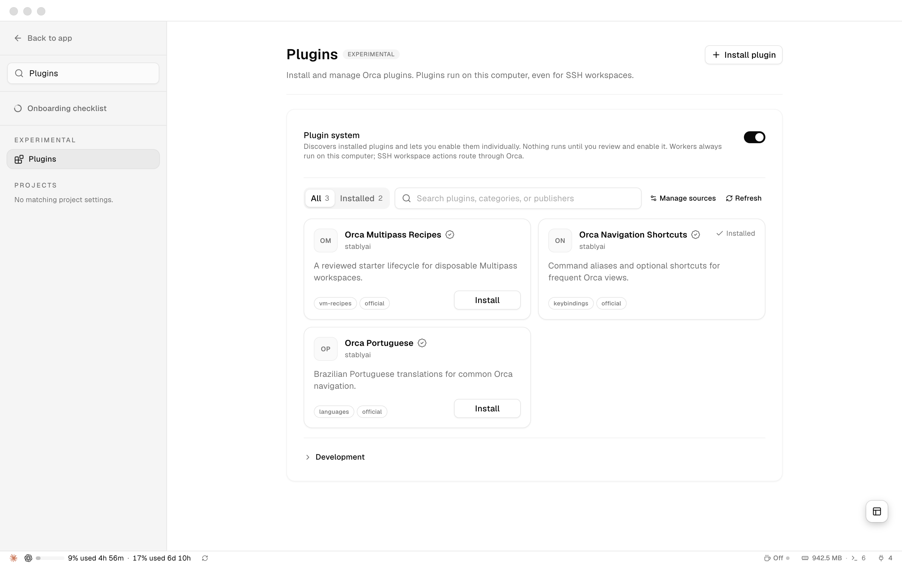
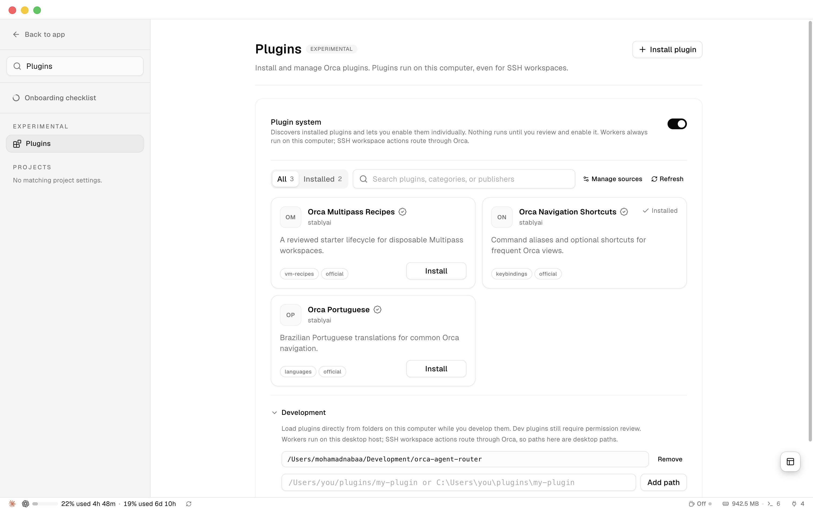
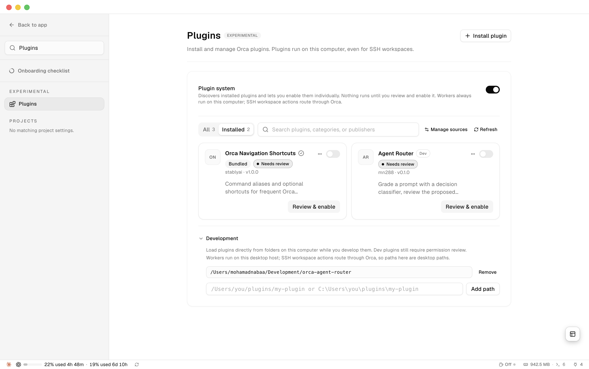
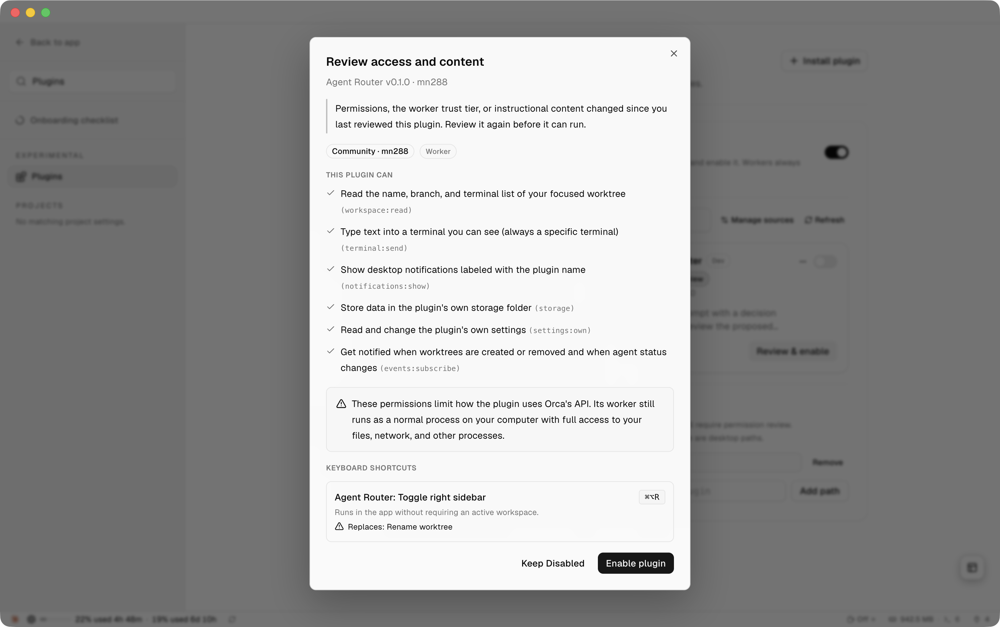

# Agent Router — an ORCA plugin

Grade a coding prompt with a decision classifier, see which harness and model
the rules pick, approve it, and only then let ORCA launch the agent.

The classifier answers four questions about your prompt — how hard it is, which
domain it belongs to, whether it needs tools, and whether it is sensitive — and
a deterministic rule set turns those signals into a ranked list of the
harness/model routes *you* configured. Nothing launches without your keypress.

## What it needs, and what it does not

**Required: one classifier, either one.** They answer the identical rubric, so
switching backends changes accuracy, latency and where your prompt goes, never
the approval or launch behaviour.

| | Jev | LAYA |
| --- | --- | --- |
| Setup | an API key, nothing installed | an endpoint you run |
| Prompt leaves your machine | yes, to TypeSafe AI | no |
| Cost | per call | free after setup |
| Prompt budget | 32,000 characters | 1,000 UTF-8 bytes |

**Required: at least one agent harness** on your PATH — any of `claude`,
`codex`, `opencode`, `goose` — plus a `routes.json` naming the models you
actually have access to.

**Not required:** any particular project, any Rust build, any model weights, any
Python package. The router is standard-library Python and the plugin is three
text files. If you already run a LAYA daemon or you are happy with Jev, nothing
else needs to exist.

## Install

The screenshots below show **ORCA 1.4.206 on macOS** with Agent Router 0.1.0.
The plugin requires ORCA 1.4.200 or newer. If you already installed it, skip to
[Use](#use).

### 1. Prepare the CLI and classifier

Clone or download this repository, then open a terminal in its root folder
(the folder containing `orca-plugin.json`). Run:

```sh
# Put the CLI on your PATH (the router/ folder is self-contained and portable)
ln -s "$PWD/router/agent-router" /opt/homebrew/bin/agent-router    # or ~/.local/bin
cp router/routes.example.json router/routes.json                   # then edit it

# Point it at a classifier — pick one
export TYPESAFE_API_KEY=…            # Jev, hosted
export LAYA_URL=http://127.0.0.1:8091   # LAYA, yours (this is also the default)

# Check it
agent-router health
```

Use an existing directory on your `PATH` for the symlink. Edit
`router/routes.json` to name the harnesses and models you can actually run; see
[Routes](#routes). Replace the API-key placeholder if you choose Jev, or start
your LAYA endpoint if you choose LAYA.

Put the exports in the profile your ORCA terminals start with, normally
`~/.zshrc`, or the panel will hand the command to a shell that cannot see them.

Do not symlink at a copy inside ORCA's installed plugin directory: that path is
content-hashed and changes on every update. Link at this folder.

### 2. Open ORCA's Plugins settings

Open **Settings** (the gear at the bottom left, or **⌘,** on macOS). Search
settings for **Plugins**, then select **Plugins** under **Experimental**.
Turn on **Plugin system** if it is off.



### 3. Add the local plugin folder

Expand **Development** at the bottom of the Plugins page. Paste the absolute
path to this repository into **Development plugin folder path**, then click
**Add path**. Run `pwd` from the repository root to get that path. Choose the
folder containing `orca-plugin.json`, not its `router/` or `panel/` subfolder.

The screenshot shows the repository path after it has been added; use your own
checkout's path.



### 4. Find Agent Router and review permissions

Select the **Installed** tab. Find **Agent Router**, published by **mn288**, with
the **Dev** badge. A new installation shows **Needs review**. Click its
**Review & enable** button.



The consent dialog lists six capabilities: workspace access, terminal input,
notifications, storage, the plugin's own settings, and event subscriptions.
Terminal input lets the panel type the router command into the terminal you
select. Review the list, then click **Enable plugin**. On this version of ORCA,
the plugin's **⌘⌥R** shortcut replaces **Rename worktree**; the dialog shows
that conflict before you enable it.



This capture is from an existing installation awaiting another review, so it
also shows a notice about changes since the previous approval.

### 5. Open the panel

Return **Back to app**, select your project workspace, and open the right
sidebar with **⌘⌥R** on macOS (`Mod+Alt+R`). Select **Agent Router** in the
sidebar. Follow [Use](#use) to choose a shell terminal and submit your first
prompt.

ORCA copies and hashes the plugin folder. After editing plugin files, refresh
the plugin in Settings → Plugins and review it again if ORCA shows
**Needs review**.

`publisher` and `id` in `orca-plugin.json` form the install identity. Change
them before sharing widely, and do it before anyone installs: a rename makes it
a different plugin. The publisher `stablyai` and ids starting `orca-` are
reserved by ORCA.

## Bringing your own LAYA

LAYA is a small non-generative classifier. The router needs exactly two HTTP
routes from wherever you run it, and `LAYA_URL` points at the host.

```
GET  /health        → {"ready": true, …}          gates `agent-router health`
POST /v1/predict    → the answers envelope below
```

Two request shapes are supported, and they produce identical answers:

```sh
# default: relies on the server registering a `router` preset
{"text": "<prompt>", "preset": "router", "lang": "fr"}

# LAYA_SEND_QUESTIONS=1: sends the rubric inline, so no preset need exist.
# Identical body shape to Jev's, prompt under `request` as the wording expects.
{"state": {"request": "<prompt>"}, "questions": {…}, "lang": "fr"}
```

Set `LAYA_SEND_QUESTIONS=1` for any LAYA-compatible endpoint that does not know
the `router` preset. Set `LAYA_API_KEY` if yours sits behind a bearer token.
The expected answer envelope, for all backends:

```json
{ "model": "…",
  "answers": {
    "difficulty":    {"type":"score",  "probabilities":{"0":…,"1":…,"2":…,"3":…}, "confidence":…},
    "domain":        {"type":"choice", "choice":"code"},
    "needs_tools":   {"type":"noul",   "noul":…},
    "is_sensitive":  {"type":"noul",   "noul":…} } }
```

A missing or malformed answer is a failure, never a zero score: you land back on
manual selection instead of getting a route chosen from absent data.

## Use

Open the right sidebar (`Mod+Alt+R`) and pick the **Agent Router** panel. Type the
prompt, choose classifier and language, press Refresh, and select a *shell*
terminal — not one already running an agent, or the command goes to that agent.

In that terminal the router prints the classification and every eligible route
with the rule that ranked it, recommendation starred. Enter takes it, a number
picks another and is logged as an override, `q` launches nothing. Then it creates
the agent terminal and sends your prompt unchanged, byte for byte.

The panel is optional:

```sh
agent-router route --prompt "Fix the race without changing the API"
agent-router route --prompt-file task.md --backend jev --harness claude --harness codex
agent-router route --prompt "…" --propose-only        # grade only, never launch
agent-router route --prompt "…" --yes --dry-run       # show the bound launch plan
agent-router route --prompt "…" --local-only          # refuses hosted classifiers and cloud routes
```

Exit codes separate the failures: 2 bad input, 3 classifier failure, 4 launch
failure.

## Routes

Each entry in `router/routes.json` is one harness/model combination you can
actually run. The shipped example is a shape, not a working configuration.

| Field | Meaning |
| --- | --- |
| `id`, `label` | Identity, and the text shown in the ranked list |
| `harness` | `claude`, `codex`, `opencode` or `goose` |
| `provider`, `model` | Passed to that harness's own flag |
| `levels` | Which of `trivial`, `easy`, `moderate`, `hard` this route serves |
| `domains` | Optional filter; empty means any domain |
| `local`, `tools` | Runs on this machine; can use tools |
| `args` | Optional extra arguments appended to the command |

Model selection uses each harness's own flag — `claude --model`, `codex -m`,
`opencode --model provider/model`, `goose session --provider … --model …` — so a
route is only as real as that harness's own configuration. A local route still
needs its provider pointed at your local server.

## Measured

Eight paired English/French prompts (`router/eval_prompts.json`), scored against
the difficulty level each prompt was expected to get. Reproduce with
`python3 router/eval.py`.

| classifier | language | accuracy | hard recall | tools recall | median latency |
| --- | --- | --- | --- | --- | --- |
| Jev `jev-1.13.0` | en | 0.75 | 1.0 | 1.0 | 720 ms |
| Jev `jev-1.13.0` | fr | 0.88 | 1.0 | 1.0 | 677 ms |
| LAYA, one local checkpoint | en | 0.38 | 0.0 | 1.0 | 86 ms |
| LAYA, one local checkpoint | fr | 0.38 | 0.0 | 1.0 | 50 ms |

The LAYA row came from one privately fine-tuned checkpoint on one machine, so
it says nothing about LAYA in general and you should not expect to reproduce it.
The Jev row is reproducible with a key.

Read this as a tradeoff, not a ranking. Jev graded difficulty reliably and was
the only backend to ever return `hard`; that LAYA checkpoint never did, so a
`hard`-only route is unreachable by recommendation there and has to be chosen by
override. LAYA answered roughly ten times faster, for free, without the prompt
leaving the machine. Both agreed on tool detection.

Eight pairs is a small sample: the French/English gap is a single prompt and
should not be read as French being easier. Both backends scored the same
`negation` prompt as `easy` against an expected `moderate`, which may say more
about the label than the models. Thresholds are not transferable between
backends, versions or languages — measure your own before trusting them.

## Good to know

- Decisions are appended to a local log: the prompt's SHA-256, the backend, the
  recommendation, and whether you overrode it. The prompt text is never written.
  macOS `~/Library/Application Support/orca-agent-router/decisions.jsonl`, Linux
  `$XDG_STATE_HOME/orca-agent-router/`, or set `AGENT_ROUTER_LOG`.
- A classifier failure never falls back to the other backend. That would change
  where your prompt is sent, so it stops and leaves you at manual selection.
- Approval binds the prompt and the route. Editing either invalidates the
  proposal and you are asked again.
- The plugin panel cannot reach the network or launch anything; ORCA sandboxes
  panels with `connect-src 'none'` and allows three actions. Everything real
  happens in the CLI, which keeps ORCA the execution owner.
- The rubric id printed on every proposal, `laya-router-v1`, records that the
  question wording is LAYA's `router` preset verbatim. Both backends are sent
  that same wording, so the id identifies the rubric, not the backend. Change
  it only together with the wording, since thresholds are tied to both.
- `cd router && python3 -m unittest` runs 22 offline tests; no network, no
  classifier, nothing launched.
- ORCA's plugin API is experimental upstream at v0 and carries no compatibility
  promise across versions.
